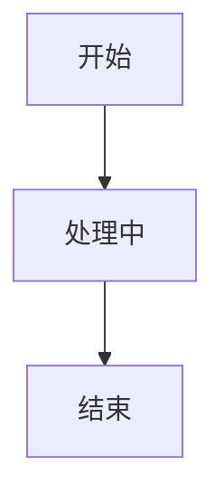

# 手册说明


> 打开即可在 **Obsidian 阅读模式**中边看说明、边看到真实渲染效果  
> 本文只使用 **Obsidian 原生支持**（无插件也可用）

---
# 一、符号系统
> 所有内容均为 Obsidian 原生支持（无插件）

---


## 1. 标题符号


### 写法
```md
# 一级标题
## 二级标题
### 三级标题
#### 四级标题
```


### 在 Obsidian 中的表现
- 标题左侧会出现 **小三角**
- 点击小三角即可 **折叠 / 展开**该标题下的所有内容
- 折叠不影响正文，只影响显示

### 使用建议
- 用标题来分块，而不是空行
- 一个标题下只做一件事

---

## 2. 列表符号

### 写法
```
- 无序列表

1. 有序列表
2. 有序列表

- [ ] 未完成
- [x] 已完成

```

### 显示

- 无序列表


1. 有序列表
2. 有序列表

- [ ] 未完成
- [x] 已完成
---


## 3.引用、强调

### 写法
```
> 普通引用

**加粗**

*斜体*

~~删除线~~

==高亮==

<u>下划线</u>

<!-- 这里是注释的内容 -->
```

### 显示

> 普通引用

**加粗**

*斜体*

~~删除线~~

==高亮==

<u>下划线</u>

<!-- 这里是注释的内容 -->

## 4. 链接、嵌入

### 写法
```


[网站](https://example.com)

[[内部链接]]

[[内部链接|显示文本]]

![[图片.png]]
  
```

### 显示


[网站](https://example.com)

[[内部链接]]

[[内部链接|显示文本]]

![[图片.png]]
  
# 二、反引号与代码（非常重要）

> **什么时候内容会被 Obsidian 解析？  
> 什么时候只是“原样显示”？**

---

### 1.行内代码（单个反引号）

**用途：**  
👉 用来“点名一个词”，而不是展示一段结构。

#### 写法

使用 **单个反引号** 包住内容：

```md
`命令`  
`关键词`  
`文件名.md`
```

#### 在 Obsidian 中的效果

`命令`  
`关键词`  
`文件名.md`


- 内容 **不会被解析**
- 不会变成标题、列表或链接
- 显示为等宽字体，视觉上像“被点名”

#### 适合的场景

- 命令名  
- 关键词  
- 文件名  
- 某个需要被“明确指出”的词


---

### 2.代码块（三个反引号）

**用途：**  
👉 用来“展示写法本身”，而不是执行它。

#### 基本结构（必须成对出现）

写法结构（**必须成对出现**）：


````
```
hello world
```
````

#### 在 Obsidian 中的效果
```
hello world
```


### ⚠️ 非常重要的规则
- **三个反引号 = 进入 / 退出代码世界**
- 没闭合 → 后面全文都会变成代码
- Obsidian 阅读模式中：
  - 代码块 = 灰底框
  - 内容不会被渲染

---

# 三、obsidian渲染实例
>  Mermaid
>  表格
>  Checklist
>  Callout
>  LaTeX

## 1.默认渲染


#### 📄 文档 / 配置类
````
```md       
```markdown
```yaml
```yml
```json
```toml
```ini
```xml
```html
```css
````
####    💻 编程语言
````
```java
```python
```py
```js
```javascript
```ts
```bash
```sh
```powershell
```c
```cpp
```go
```sql
````

示例

````
```py
def greet(name):
    print(f"Hello, {name}!")

greet("KK")
```
````

```py
def greet(name):
    print(f"Hello, {name}!")

greet("KK")
```

## 2.Mermaid（流程图 / 甘特图/思维导图）

Mermaid 是 **Obsidian 原生支持** 的可视化语言。

### 基本用法

````

````


### 使用规范
- ` ```mermaid ` 必须写在第一行
- 结尾必须用 ` ``` ` 关闭
- 阅读模式下会直接显示为图

### 常见用途

| 图表类型 | 开始标记 | 主要用途 | Obsidian支持 |
|----------|----------|----------|--------------|
| 流程图 | `flowchart TD/LR` | 流程、算法 | ✅ 原生支持 |
| 时序图 | `sequenceDiagram` | 交互、调用顺序 | ✅ 原生支持 |
| 类图 | `classDiagram` | 面向对象设计 | ✅ 原生支持 |
| 状态图 | `stateDiagram-v2` | 状态转换 | ✅ 原生支持 |
| 甘特图 | `gantt` | 项目时间线 | ✅ 原生支持 |
| 饼图 | `pie` | 比例分配 | ✅ 原生支持 |
| 思维导图 | `mindmap` | 头脑风暴 | ✅ 原生支持 |
| ER图 | `erDiagram` | 数据库设计 | ✅ 原生支持 |
| 象限图 | `quadrantChart` | 优先级分析 | ✅ 原生支持 |
| 用户旅程图 | `journey` | 用户体验地图 | ✅ 原生支持 |
| Git图 | `gitGraph` | Git分支操作 | ✅ 原生支持 |
| 需求图 | `requirementDiagram` | 系统需求分析 | ✅ 原生支持 |
| 时间线图 | `timeline` | 历史事件时间线 | ✅ 原生支持 |
| C4图 | `C4Context` | 软件架构图 | ⚠️ 需要配置 |
| 架构图 | `architecture-diagram` | 系统架构 | ⚠️ 实验性 |
| 包图 | `package-diagram` | 包/模块关系 | ⚠️ 实验性 |
| 网络图 | `network` | 网络拓扑 | ⚠️ 实验性 |
| 桑基图 | `sankey-beta` | 流量/资源分配 | ⚠️ 实验性 |

---

## 3.表格（对照 / 判断）

### 写法
```
| 项目 | 说明 | 备注 |
|---|---|---|
| A | 示例 | 可选 |
| B | 示例 | 可选 |
```
### 显示
| 项目 | 说明 | 备注 |
|---|---|---|
| A | 示例 | 可选 |
| B | 示例 | 可选 |

### 使用建议
- 表格用于 **对照与判断**
- 不用于长段叙述

---


## 4.Callout（信息块 / 提示块）

>Obsidian 原生支持的强调块。

#### 写法

```
>[!note] 注释  
>i love u

>[!tip] 提示  

>[!warning] 警告  

>[!danger] 红线  

```


#### 效果

>[!note] 注释  
i love u

>[!tip] 提示  


>[!warning] 警告  


>[!danger] 红线  


### 使用建议
- 表达规则 / 风险 / 提醒
- 内容要短、明确

---

## 5.LaTeX（数学公式）

Obsidian 原生支持 LaTeX 渲染。

### 行内公式
写法：
`$a^2 + b^2 = c^2$`

效果：
$a^2 + b^2 = c^2$

---

### 块级公式
写法：
```
$$
\sum_{i=1}^{n} i = \frac{n(n+1)}{2}
$$
```


效果：
$$
\sum_{i=1}^{n} i = \frac{n(n+1)}{2}
$$


---


# 进阶再考虑

- YAML
- Dataview
- 
## YAML 元数据

写在文件最顶部：

```yaml
---
type: note
category: manual
date: 2025-01-01
---
```

用途：
- 分类
- 查询
- 为 Dataview 做准备（插件）


---
