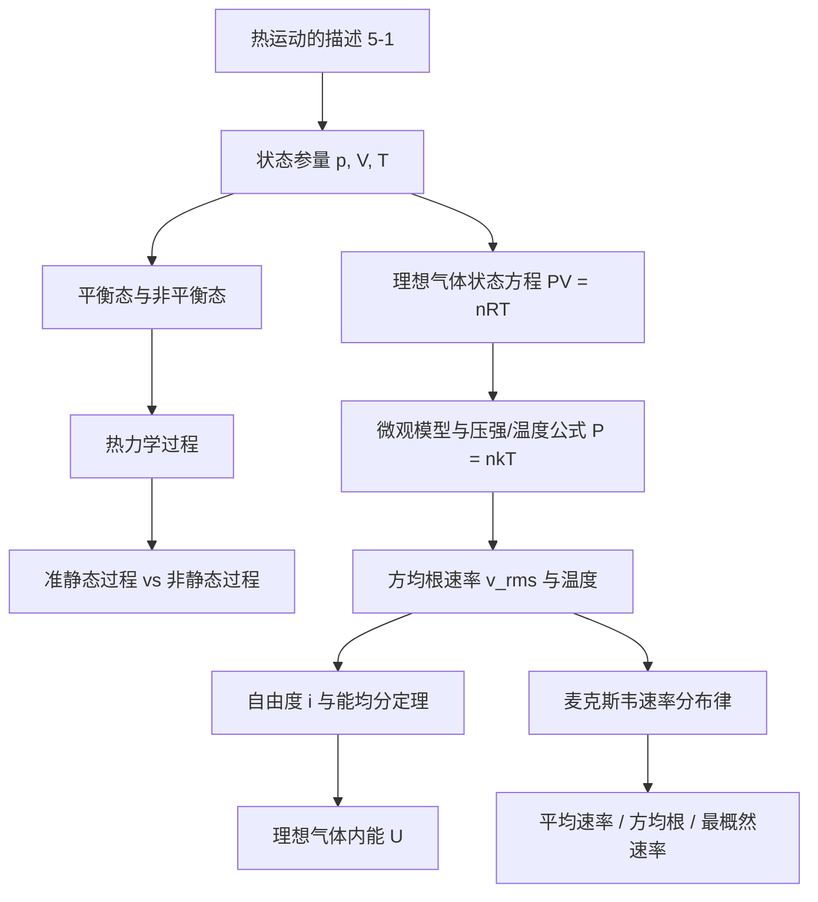
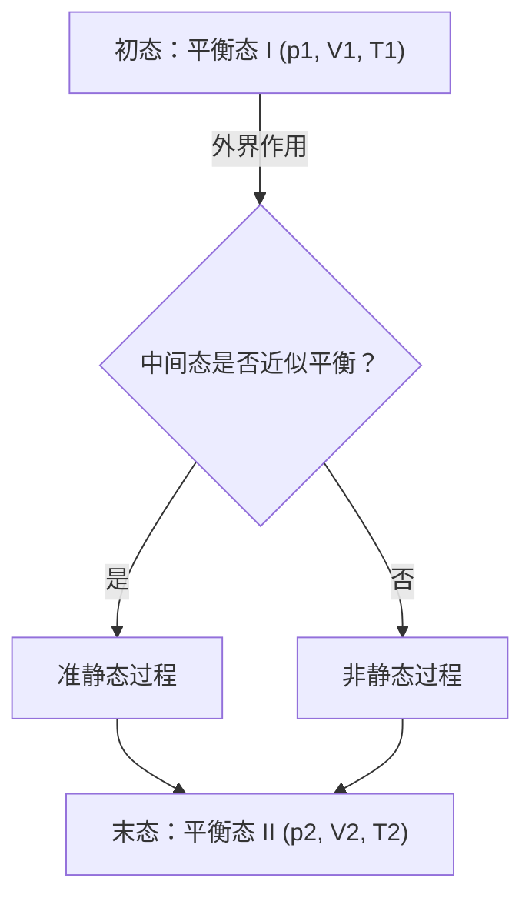
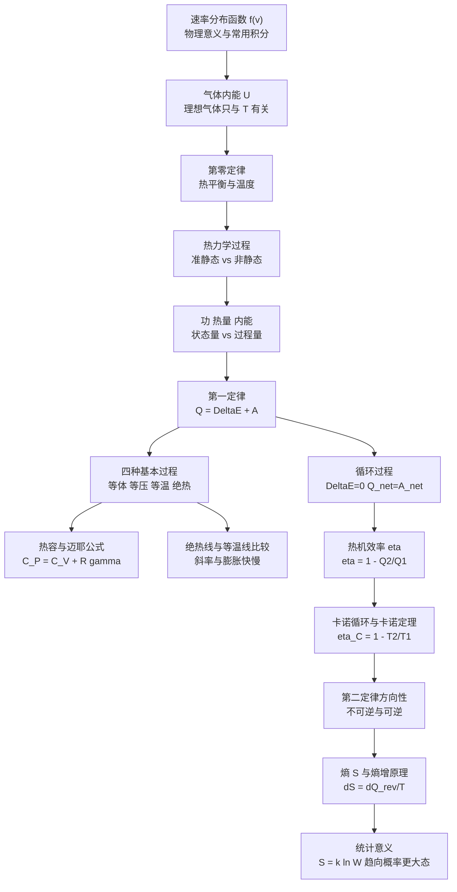
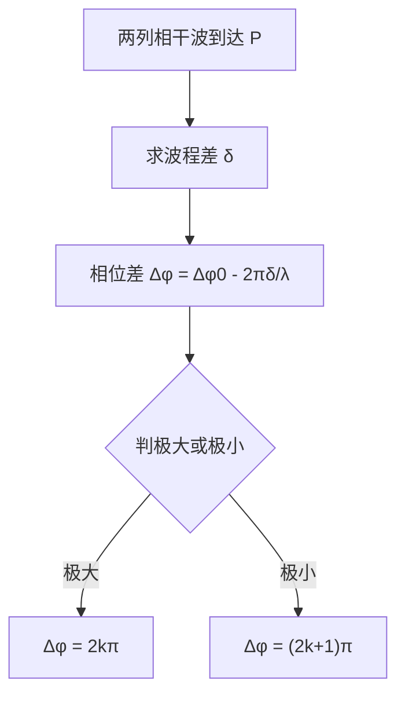
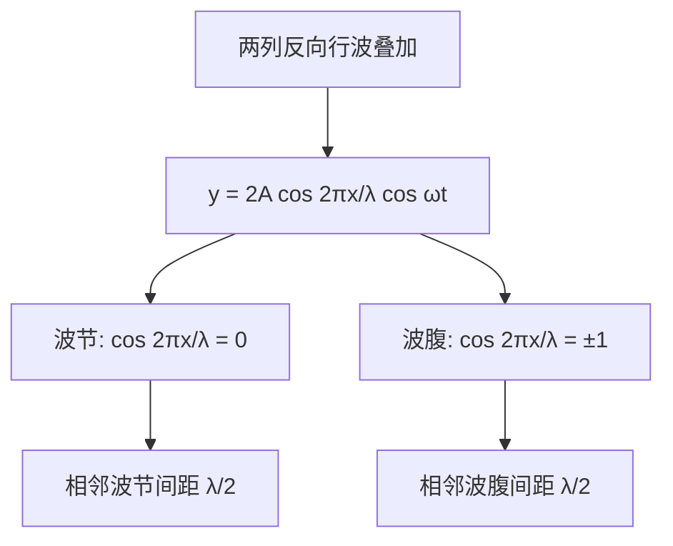
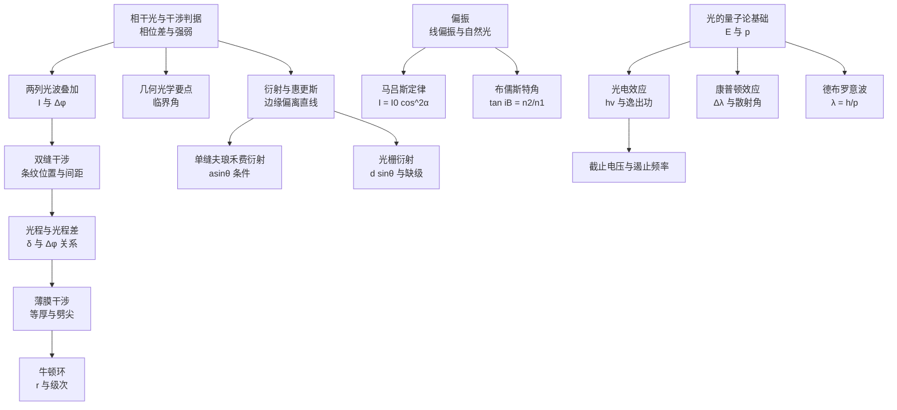
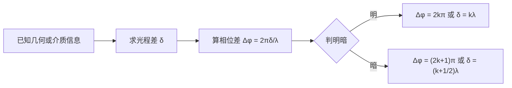
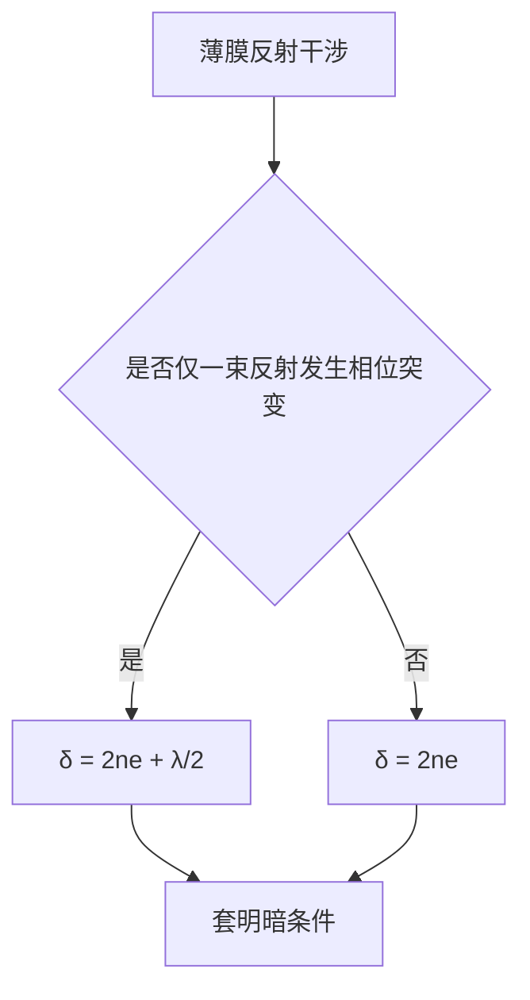

# 热运动与理想气体


> 约定：公式用 LaTeX（公式排版语法）；图示尽量用 Mermaid。

---

## 0. 本节结构（你复习时的抓手）



---

## 1. 状态参量与热力学系统

### 1.1 状态参量（宏观量）
- 压强 $p$
- 体积 $V$
- 温度 $T$

这些量用来描述“宏观状态”（忽略具体每个分子的运动细节）。

### 1.2 热力学系统
热力学系统：由大量微观粒子（分子、原子等）组成的宏观物体，是热学研究对象。

---

## 2. 平衡态（Equilibrium）与非平衡态

### 2.1 平衡态定义
平衡态：在不受外界影响的条件下，系统宏观性质**均匀一致**、且**不随时间变化**的状态。

气体状态 $(P,V,T)$ 一般指平衡态。

### 2.2 平衡条件（常用判据）
1. 系统与外界在宏观上无能量和物质交换  
2. 系统宏观性质不随时间改变

不满足上述任一条 → 非平衡态。

---

## 3. 热力学过程与准静态过程

### 3.1 过程（Process）
系统在外界影响下，从一个状态到另一个状态的变化，称为热力学过程。

### 3.2 准静态过程（Quasi-static）
准静态过程：系统从一平衡态到另一平衡态，且过程中所有中间态都可近似看作平衡态。

非静态过程：中间态为非平衡态。

#### 典型对比
- 准静态：气体等温膨胀（缓慢进行）
- 非静态：气体自由膨胀（不可把中间态视作平衡态）




### 3.3 状态图（P-V 图）
对准静态过程，常用 $P$-$V$ 图上一条曲线表示过程；曲线上每一点表示一个平衡态，这种图叫状态图。

---

## 4. 理想气体状态方程（宏观）

### 4.1 三个经典实验定律
- 玻意耳—马略特定律（等温）：  
  $$
PV=\text{constant}
$$
- 盖—吕萨克定律（等压）：  
  $$
\frac{V}{T}=\text{constant}
$$
- 查理定律（等容）：  
  $$
\frac{P}{T}=\text{constant}
$$

### 4.2 克拉伯龙方程（理想气体状态方程）
$$
PV=nRT
$$
其中 $n$ 为物质的量（mol），$R$ 为气体常数。

---

## 5. 理想气体的微观模型与温度公式

### 5.1 温度的统计意义（关键结论）
理想气体压强与分子热运动平均动能有关，最终得到：

- 压强公式（常见写法）  
  $$
P = nkT
$$
  $n$：数密度（单位体积内分子数），$k$：玻尔兹曼常数。

- 平均平动动能与温度的关系  
  $$
\overline{\varepsilon}=\frac{3}{2}kT
$$

含义：不同理想气体只要 $T$ 相同，则分子平均平动动能相同。

---

## 6. 方均根速率（RMS (Root Mean Square，均方根)）

定义：大量分子速率平方平均值的平方根  
$$
v_{\mathrm{rms}}=\sqrt{\overline{v^2}}
$$

对理想气体（单原子/只看平动）：
$$
v_{\mathrm{rms}}=\sqrt{\frac{3kT}{m}}
=\sqrt{\frac{3RT}{M}}
$$

结论：
- $v_{\mathrm{rms}}\propto \sqrt{T}$（温度越高，越快）
- $v_{\mathrm{rms}}\propto 1/\sqrt{M}$（摩尔质量越大，越慢）

---

## 7. 自由度与能均分定理（Equipartition）

### 7.1 自由度 $i$
自由度：确定一个分子/物体的运动状态所需的独立坐标数目（可理解为“独立运动方式的数量”）。

### 7.2 能均分定理
平衡态下：每一个“可能自由度”对应的平均动能为
$$
\frac{1}{2}kT
$$
若分子有 $i$ 个自由度，则单分子平均动能：
$$
\overline{E}=\frac{i}{2}kT
$$

---

## 8. 理想气体内能（Internal Energy）

内能：系统全部微观粒子的能量总和（此处对理想气体主要指分子热运动动能总和）。

对理想气体（忽略分子间势能）：
$$
U = N\cdot \frac{i}{2}kT
$$
若用物质的量表示（1 mol 对应 $N_A$ 个分子）：
$$
U = \frac{i}{2}nRT
$$
温度改变引起内能改变：
$$
\Delta U=\frac{i}{2}nR\Delta T
$$

---

## 9. 麦克斯韦速率分布律（Maxwell speed distribution）

### 9.1 速率分布函数 $f(v)$
定义：分子速率落在 $[v, v+\mathrm{d}v]$ 的概率密度。  
因此：
- 概率：$f(v)\mathrm{d}v$
- 对应分子数：$N f(v)\mathrm{d}v$

归一化：
$$
\int_0^{\infty} f(v)\,\mathrm{d}v = 1
$$

区间概率：
$$
P(v_1\le v\le v_2)=\int_{v_1}^{v_2} f(v)\,\mathrm{d}v
$$

### 9.2 分布函数（典型形式）
$$
f(v)=4\pi\left(\frac{m}{2\pi kT}\right)^{3/2} v^2 e^{-\frac{mv^2}{2kT}}
$$

### 9.3 三个典型速率
- 算术平均速率：
$$
\bar v=\int_0^\infty v f(v)\,\mathrm{d}v=\sqrt{\frac{8kT}{\pi m}}
=\sqrt{\frac{8RT}{\pi M}}
$$
- 方均根速率：
$$
v_{\mathrm{rms}}=\sqrt{\overline{v^2}}=\sqrt{\frac{3kT}{m}}
=\sqrt{\frac{3RT}{M}}
$$
- 最概然速率（峰值处）：
$$
v_p=\sqrt{\frac{2kT}{m}}=\sqrt{\frac{2RT}{M}}
$$

关系：
$$
v_p < \bar v < v_{\mathrm{rms}}
$$

### 9.4 分布曲线随 $T$、$m$ 的变化（定性）
```mermaid
flowchart TD
  T["温度 T 上升"] --> A["峰值右移<br/>典型速率增大"]
  T --> B["曲线变平坦<br/>分布更分散<br/>高速分子比例上升"]
  ```

```mermaid
flowchart TD
  m["分子质量 m 上升"] --> C["峰值左移<br/>典型速率减小"]
  m --> D["曲线更尖<br/>速率更集中在较小范围"]
```

---

## 10. 你复习时的“可提问点”（用于我们后续协作）

1. 为什么“气体状态 (P,V,T) 通常指平衡态”？非平衡态时 $P,V,T$ 是否还能定义？  
2. “准静态”与“可逆”之间是什么关系？（常见易混）  
3. 从 $PV=nRT$ 到 $P=nkT$ 的桥梁：$R=N_A k$ 与数密度 $n=N/V$ 如何串起来？  
4. 能均分定理里自由度 $i$ 的取值：单原子、双原子、多原子分别怎么取？在不同温度下会不会变化？  
5. 三种速率为什么一定满足 $v_p < \bar v < v_{\mathrm{rms}}$？（从分布形状直观解释）

---

## 11. 来源索引（便于你回查）
- 状态参量 / 平衡态 / 准静态过程 / 状态方程：主要来自课件内容（PPT）。  
- $P=nkT$、$\overline{\varepsilon}=\frac32 kT$、$U=\frac{i}{2}nRT$、麦克斯韦分布与三种速率公式：来自 PDF 中对应页及课件推导页。


# 热力学第零定律、第一定律、循环与熵


---

## 0. 本节结构



---

## 1. 概念

### 1.1 速率分布函数 $f(v)$
- 定义：$f(v)$ 表示分子速率落在 $[v, v+dv]$ 的概率密度。
- 直觉：把“不同速率出现的可能性”画成一条曲线；越高表示该速率更常见。
- 适用条件：气体处于平衡态；讨论的是速率分布（不是速度矢量分布）。
- 常见坑：把 $f(v)$ 当“概率”而不是“概率密度”；概率必须乘 $dv$ 才有意义。

### 1.2 热力学第零定律
- 定义：若 A 与 B 热平衡，B 与 C 热平衡，则 A 与 C 也热平衡。
- 直觉：温度是“热平衡可传递”的共同标尺。
- 适用条件：讨论对象处于热平衡（宏观量稳定）。
- 常见坑：把“热接触”当成必然有热交换；热平衡意味着无净热交换。

### 1.3 准静态过程（Quasi-static Process，准静态过程）
- 定义：过程足够缓慢，使系统几乎始终处于一系列平衡态。
- 直觉：每一步都“来得及平衡”，因此能给每一瞬间定义 $p,V,T$。
- 适用条件：需要写体积功 $A=\int p\,dV$ 时（要求过程曲线上的每点可视为平衡态）。
- 常见坑：准静态不等于可逆；可逆还要求无耗散（摩擦、粘滞、有限温差传热等）。

### 1.4 状态量与过程量
- 定义：
  - 状态量：只由状态决定，如 $E$（内能）、$p,V,T$。
  - 过程量：与路径有关，如 $Q$（热量）、$A$（功）。
- 直觉：状态量像“位置”，过程量像“走了哪条路、走了多少”。
- 适用条件：比较不同路径连接同一初末态时。
- 常见坑：把 $Q$、$A$ 当状态量；或者认为“同初末态的功相同”。

### 1.5 内能 $E$（Internal Energy，内能）
- 定义：系统内部微观粒子能量的总和。理想气体内能可近似只由分子热运动动能决定。
- 直觉：看不见的“分子层面能量仓库”。
- 适用条件：理想气体模型下，$E$ 只与 $T$ 有关（与 $V$、路径无关）。
- 常见坑：把“吸热一定升温”当成必然；吸热也可能一部分做功，不全变成内能。

### 1.6 循环过程与热机
- 定义：
  - 循环过程：经历一系列变化后回到初态，因此 $\Delta E=0$。
  - 热机：把吸收热量的一部分转化为对外做功的装置。
- 直觉：回到原点说明“内能没净变化”，净功来自“吸热与放热不相等”。
- 适用条件：题目出现“循环、热机效率、卡诺”等关键词或给出闭合 $p-V$ 图。
- 常见坑：把 $Q_2$ 的符号弄乱；常用 $Q_1,Q_2$ 记“吸热/放热量的绝对值”。

### 1.7 可逆过程与不可逆过程
- 定义：
  - 可逆：过程可在无任何额外变化的前提下完全逆转（本质：无耗散）。
  - 不可逆：不能满足上述条件（存在摩擦、粘滞、有限温差传热、自由膨胀等）。
- 直觉：可逆是“理想极限”，不可逆是现实常态。
- 适用条件：讨论卡诺上限、熵变定义时。
- 常见坑：把“很慢”当成可逆；慢只是准静态，未必无耗散。

### 1.8 熵 $S$（Entropy，熵）
- 定义：熵是状态函数；用于表征过程方向性与不可逆性。两状态间熵变可用可逆路径积分计算。
- 直觉：系统更倾向于走向“微观可能性更多”的宏观态。
- 适用条件：判断自发方向、计算可逆/不可逆差别、讨论效率上限。
- 常见坑：只算系统不算环境；熵增原理说的是“孤立系统总熵”。

---

## 2. 公式

### 2.1 $f(v)$ 相关表达式的物理意义
- 公式：
$$
f(v)\,dv
$$
$$
N f(v)\,dv
$$
$$
\int_{0}^{v_p} f(v)\,dv
$$
$$
\int_{v_1}^{v_2} v\,f(v)\,dv
$$
$$
\int_{0}^{\infty} \frac12 m v^2 f(v)\,dv
$$
- 符号解释：
  - $f(v)$：速率分布函数（概率密度）
  - $N$：分子总数
  - $m$：单个分子质量
  - $v_p$：最概然速率（分布峰值对应速率）
- 适用条件：平衡态速率分布。
- 使用步骤（3 步以内）：
  1) 看到 $f(v)\,dv$：先判断是“概率”还是“分子数”
  2) 需要“某范围概率”就积分 $\int f(v)\,dv$
  3) 需要“平均某量”就做加权积分（如 $\int v f(v)\,dv$）

### 2.2 理想气体内能
- 公式：
$$
E = \frac{i}{2} nRT
$$
$$
\Delta E = \frac{i}{2} nR\Delta T = nC_V\Delta T
$$
- 符号解释：
  - $i$：自由度
  - $n$：物质的量（mol）
  - $R$：气体常数
  - $C_V$：定容摩尔热容
- 适用条件：理想气体模型；$i$ 取值需按模型/温区（考试常用固定取值）。
- 使用步骤：
  1) 判定气体类型并取 $i$
  2) 用温度变化求 $\Delta E$
  3) 作为第一定律中的 $\Delta E$

### 2.3 热力学第一定律
- 公式（符号约定：$A>0$ 表示系统对外做功）：
$$
Q = \Delta E + A
$$
微分形式：
$$
dQ = dE + dA
$$
- 符号解释：
  - $Q$：系统吸收热量（吸热为正）
  - $A$：系统对外做功（对外为正）
  - $E$：内能
- 适用条件：任意热力学过程（先统一符号）。
- 使用步骤：
  1) 写出过程特征（如等温 $\Delta E=0$、绝热 $Q=0$ 等）
  2) 求 $A$ 与 $\Delta E$
  3) 用第一定律求未知量

### 2.4 准静态体积功与 $p-V$ 图面积
- 公式：
$$
A = \int_{V_1}^{V_2} p\,dV
$$
- 符号解释：$p(V)$ 为过程中的压强-体积关系。
- 适用条件：准静态过程。
- 使用步骤：
  1) 写出过程方程 $p(V)$
  2) 积分得到 $A$
  3) 代回第一定律求 $Q$ 或 $\Delta E$

### 2.5 四种基本过程（理想气体）
- 等体（$V$ 常量）：
$$
A=0,\quad Q=\Delta E
$$
- 等压（$p$ 常量）：
$$
A=p(V_2-V_1)=nR\Delta T,\quad Q=\Delta E + A
$$
- 等温（$T$ 常量）：
$$
\Delta E=0,\quad Q=A
$$
$$
A=nRT\ln\frac{V_2}{V_1}=nRT\ln\frac{p_1}{p_2}
$$
- 绝热（$Q=0$）：
$$
Q=0,\quad \Delta E=-A
$$
可逆绝热方程：
$$
pV^\gamma=\text{constant},\quad TV^{\gamma-1}=\text{constant}
$$
- 符号解释：
  - $\gamma$ (heat capacity ratio，热容比) $=C_P/C_V$
- 适用条件：对应过程“真的成立”（题干给条件）；可逆绝热需要“绝热 + 无耗散”。
- 使用步骤：
  1) 先写过程特征（谁为 0/谁为常量）
  2) 用状态方程/过程方程求终态
  3) 计算 $A,\Delta E,Q$

### 2.6 热容与迈耶公式
- 公式：
$$
C_P = C_V + R
$$
$$
\gamma=\frac{C_P}{C_V}
$$
理想气体常用：
$$
C_V=\frac{i}{2}R,\quad C_P=\frac{i+2}{2}R,\quad \gamma=\frac{i+2}{i}
$$
- 符号解释：
  - $C_V$ (constant volume heat capacity，定容摩尔热容)
  - $C_P$ (constant pressure heat capacity，定压摩尔热容)
- 适用条件：理想气体。
- 使用步骤：
  1) 由气体类型取 $i$
  2) 算 $C_V,C_P,\gamma$
  3) 代入 $Q=nC\Delta T$ 或绝热方程

### 2.7 等温线与绝热线比较（定性）
- 公式（等温）：
$$
pV=\text{constant}
$$
- 公式（可逆绝热）：
$$
pV^\gamma=\text{constant}\quad (\gamma>1)
$$
- 结论（定性）：同一点出发做膨胀，绝热线比等温线更“陡”，压强下降更快。
- 适用条件：理想气体；绝热为可逆绝热。

### 2.8 循环过程、效率与卡诺上限
- 循环：
$$
\Delta E=0\Rightarrow Q_{\text{net}}=A_{\text{net}}
$$
- 热机效率：
$$
\eta=\frac{A_{\text{net}}}{Q_1}=1-\frac{Q_2}{Q_1}
$$
- 卡诺效率（上限）：
$$
\eta_C=1-\frac{T_2}{T_1}
$$
- 符号解释：
  - $Q_1$：从高温热源吸热量（按绝对值）
  - $Q_2$：向低温热源放热量（按绝对值）
  - $T_1,T_2$：高温/低温热源温度
- 适用条件：卡诺效率用于“最大效率/可逆热机上限”。

### 2.9 熵的定义与熵增原理
- 定义式（用可逆路径计算）：
$$
dS=\frac{\delta Q_{\text{rev}}}{T}
$$
$$
\Delta S=\int_{1}^{2}\frac{\delta Q_{\text{rev}}}{T}
$$
- 熵增原理（孤立系统）：
$$
\Delta S_{\text{total}}\ge 0
$$
- 适用条件：不可逆过程计算熵变时，必须选“同初末态的可逆路径”做积分。

### 2.10 熵的统计意义
- 公式：
$$
S = k\ln W
$$
- 符号解释：
  - $k$：玻尔兹曼常数
  - $W$：对应宏观态的微观状态数
- 适用条件：用于理解第二定律的方向性（概率从小到大）。

---

## 3. 题型模板

### 3.1 过程计算：给初末态或给过程条件，求 $Q,A,\Delta E$
- 题型识别：出现“等体/等压/等温/绝热/准静态”或给 $p-V$ 图。
- 标准步骤：
  1) 写过程特征（谁为常量、谁为 0）
  2) 求 $A$（等温对数功/等压线性功/准静态积分/绝热用 $\Delta E$ 反推）
  3) 用第一定律 $Q=\Delta E + A$ 收尾
- 易错点：
  - 忘记符号约定（做功方向）
  - 不可逆绝热（如自由膨胀）误用 $pV^\gamma=\text{constant}$

### 3.2 $p-V$ 图：面积与路径相关
- 题型识别：给出两条不同路径连接同一初末态，问功/热量不同与否。
- 标准步骤：
  1) 说明 $A=\int p\,dV$ 与路径相关（面积不同）
  2) 说明 $\Delta E$ 只与初末态有关（理想气体只与 $T$ 有关）
  3) 用第一定律解释为何 $Q$ 也随路径改变
- 易错点：
  - 以为同初末态功相同
  - 把 $Q$ 当状态量

### 3.3 热机效率与卡诺上限
- 题型识别：出现“热机、效率、最大效率、卡诺”。
- 标准步骤：
  1) 循环先写 $\Delta E=0$
  2) 用 $\eta=1-Q_2/Q_1$ 求效率
  3) 若问最大效率直接用 $\eta_C=1-T_2/T_1$
- 易错点：
  - $Q_2$ 代入带符号导致效率>1 或负数
  - 忘了温度用绝对温标（K）

### 3.4 熵变与方向判断
- 题型识别：出现“熵、可逆/不可逆、自发方向、孤立系统”。
- 标准步骤：
  1) 明确系统边界（是否可视作孤立系统）
  2) 用可逆路径计算熵变（或比较总熵变）
  3) 用 $\Delta S_{\text{total}}\ge 0$ 判方向
- 易错点：
  - 不可逆过程直接写 $dS=\delta Q/T$（缺少 rev）
  - 只算系统熵不算环境熵

---

> [图待补]：课件中的 $p-V$ 曲线、卡诺循环示意图、绝热线/等温线对比图。  
> 处理原则：保留“面积=功”“循环面积=净功”“绝热线更陡”这些可直接用于解题的结论。


# 简谐振动与机械波
---

## 0. 本节结构

```mermaid
flowchart TD
  A["简谐振动定义<br/>回复力与位移成正比反向"] --> B["运动学表达式<br/>x A omega phi"]
  B --> C["特征量<br/>A T nu omega phi"]
  B --> D["速度加速度关系<br/>v a 与 x 的关系"]
  B --> E["能量<br/>动能 势能 总能"]
  E --> F["初始条件求 A phi0<br/>x0 v0"]
  B --> G["旋转矢量表示法<br/>相位与投影"]
  G --> H["同方向同频率合成<br/>A 合与相位差"]
  ```
  
```mermaid
flowchart TD  
  I["机械波基本概念<br/>波源 介质 波前"] --> J["波函数<br/>y x t"]
  J --> K["波速关系<br/>u lambda T nu"]
  J --> L["正向与反向传播<br/>t 减 x u 与 t 加 x u"]
  J --> M["波的能量与强度<br/>能流 强度 I"]
  M --> N["特性阻抗 Z<br/>Z ρu"]
  ```
  
  ```mermaid
flowchart TD
  O["波的叠加原理<br/>线性叠加"] --> P["干涉条件<br/>相干 相位差恒定"]
  P --> Q["强弱分布<br/>I 与 Δφ"]
  Q --> R["驻波<br/>两列反向行波叠加"]
  R --> S["波节波腹位置<br/>间距 λ/2"]
  R --> T["半波损失<br/>反射相位突变 π"]
```


---

## 1. 概念

### 1.1 简谐振动 SHM (Simple Harmonic Motion，简谐振动)
- 定义：质点在平衡位置附近振动，且加速度与位移成正比、方向相反：$a=-\omega^2 x$。
- 直觉：越偏离平衡位置，拉回越强；方向永远指向平衡位置。
- 适用条件：系统近似线性（回复力近似 $F=-kx$），阻尼与外驱可忽略或题目未引入。
- 常见坑：把“周期运动”都当成 SHM（简谐振动只是一类特殊周期运动）。

### 1.2 描述简谐振动的特征量
- 定义：
  - 振幅 $A$：最大位移
  - 周期 $T$：完成一次振动所需时间
  - 频率 $\nu$：单位时间内振动次数，$\nu=1/T$
  - 角频率 $\omega$：$\omega=2\pi/T=2\pi\nu$
  - 相位 $\phi$ 与初相 $\phi_0$：描述振动“进行到哪一步”
- 直觉：$A$ 决定“摆多大”，$\omega$ 决定“走多快”，$\phi$ 决定“现在在哪儿”。
- 适用条件：使用标准表达式 $x=A\cos(\omega t+\phi_0)$。
- 常见坑：把 $\omega$ 当频率；单位不同：$\omega$ 是 rad/s，$\nu$ 是 Hz。

### 1.3 旋转矢量表示法
- 定义：用长度为 $A$ 的矢量以角速度 $\omega$ 匀速转动，其在某轴上的投影满足 $x=A\cos(\omega t+\phi_0)$。
- 直觉：一圈对应 $2\pi$ 相位；投影就是简谐变化。
- 适用条件：处理相位差、合成振动（同频）时。
- 常见坑：把“矢量本身”当成位移；真正的位移是“投影”。

### 1.4 机械波（Mechanical Wave，机械波）
- 定义：由波源激发，依靠介质弹性在空间传播的振动形式；传播的是“状态”和“能量”，不是介质整体迁移。
- 直觉：绳波上每个质点上下振动，波形沿绳传播。
- 适用条件：线性小振幅波（通常默认）。
- 常见坑：把质点振动速度当波速；质点速度与波速概念不同。

### 1.5 波函数与传播方向
- 定义：波函数给出“介质某点在某时刻的位移”：
  - 沿 $+x$ 方向：相位与 $t-x/u$ 相关
  - 沿 $-x$ 方向：相位与 $t+x/u$ 相关
- 直觉：同一相位点（波峰）随时间向前走，满足 $x=ut+\text{const}$。
- 适用条件：写波函数、判断传播方向。
- 常见坑：把符号写反导致方向判断错。

### 1.6 相干、干涉与叠加
- 定义：
  - 叠加原理：同一点的合位移等于各列波位移代数和。
  - 干涉：两列相干波叠加导致空间上出现稳定强弱分布。
  - 相干：频率相同且相位差恒定（或相位差随时间变化可控）。
- 直觉：相位关系稳定，图样才稳定。
- 适用条件：干涉条纹、强弱分布题。
- 常见坑：只写“同频”不够；必须相位差恒定。

### 1.7 驻波（Standing Wave，驻波）
- 定义：两列频率相同、振幅相同、沿相反方向传播的行波叠加形成驻波；波形不向前传播，出现波节与波腹。
- 直觉：一边来的波和反射波对打，某些点永远不动（波节），某些点振幅最大（波腹）。
- 适用条件：绳固定端反射、管柱共振（若题目涉及）。
- 常见坑：驻波“整体不传能”是指平均意义下无净能流，但局部能量在动能/势能间交换。

### 1.8 半波损失（Phase Inversion，反射相位反转）
- 定义：波从“疏介质”入射到“密介质”反射时，反射波相位突变 $\pi$（相当于位移反号），可视作波程增加 $\lambda/2$。
- 直觉：固定端反射会“翻折”。
- 适用条件：反射边界导致的波节/波腹判断。
- 常见坑：把所有反射都当半波损失；入射到更疏介质时一般不反相（题目按常见理想模型）。

---

## 2. 公式

### 2.1 简谐振动的动力学与运动学方程
- 公式：
$$
a=\frac{d^2x}{dt^2}=-\omega^2 x
$$
$$
x=A\cos(\omega t+\phi_0)
$$
$$
v=\frac{dx}{dt}=-\omega A\sin(\omega t+\phi_0)
$$
$$
a=\frac{d^2x}{dt^2}=-\omega^2 A\cos(\omega t+\phi_0)
$$
- 符号解释：$A$ 振幅，$\omega$ 角频率，$\phi_0$ 初相。
- 适用条件：简谐振动模型。
- 使用步骤（3 步以内）：
  1) 由题给条件确定 $\omega$（或由 $k,m$ 得到）
  2) 写 $x(t)$
  3) 需要 $v,a$ 直接对 $x(t)$ 求导

### 2.2 周期、频率、角频率
- 公式：
$$
\nu=\frac{1}{T},\quad \omega=\frac{2\pi}{T}=2\pi\nu
$$
- 符号解释：$\nu$ 频率（Hz），$T$ 周期（s），$\omega$ 角频率（rad/s）。
- 适用条件：特征量互换。

### 2.3 初始条件确定 $A$ 与 $\phi_0$
- 公式（取 $t=0$）：
$$
x_0=A\cos\phi_0,\quad v_0=-\omega A\sin\phi_0
$$
由此：
$$
A=\sqrt{x_0^2+\left(\frac{v_0}{\omega}\right)^2}
$$
$$
\tan\phi_0=-\frac{v_0}{\omega x_0}
$$
- 符号解释：$x_0,v_0$ 为初始位移和初始速度。
- 适用条件：已知 $x_0,v_0$。
- 使用步骤：
  1) 先算 $A$
  2) 再用 $\tan\phi_0$ 求 $\phi_0$
  3) 用 $x_0$ 与 $v_0$ 的符号判象限（避免相位错半个周期）

### 2.4 简谐振动的能量
- 公式（以弹簧振子为例）：
$$
E_k=\frac12 mv^2=\frac12 m\omega^2 A^2\sin^2(\omega t+\phi_0)
$$
$$
E_p=\frac12 kx^2=\frac12 kA^2\cos^2(\omega t+\phi_0)
$$
$$
E=E_k+E_p=\frac12 kA^2=\frac12 m\omega^2 A^2
$$
并有：
$$
\omega^2=\frac{k}{m}
$$
- 符号解释：$m$ 质量，$k$ 弹簧劲度系数。
- 适用条件：线性弹簧、无耗散。
- 使用步骤：
  1) 先找 $A$ 与 $\omega$（或 $k,m$）
  2) 总能量直接用 $E=\frac12 kA^2$
  3) 需要瞬时动能/势能再代入 $x(t),v(t)$

### 2.5 同方向同频率振动的合成
- 公式（同频 $\omega$）：
$$
x_1=A_1\cos(\omega t+\phi_1),\quad x_2=A_2\cos(\omega t+\phi_2)
$$
合成：
$$
x=x_1+x_2=A\cos(\omega t+\phi_0)
$$
其中振幅：
$$
A=\sqrt{A_1^2+A_2^2+2A_1A_2\cos\Delta\phi}
$$
相位差：
$$
\Delta\phi=\phi_2-\phi_1
$$
- 符号解释：$A$ 为合振幅，$\phi_0$ 为合相位。
- 适用条件：同频同方向叠加。
- 使用步骤：
  1) 先算 $\Delta\phi$
  2) 用振幅公式算 $A$
  3) 若只问“最大/最小”，直接用 $\cos\Delta\phi=\pm1$ 判断

### 2.6 平面简谐波的波函数与波速关系
- 公式（沿 $+x$）：
$$
y(x,t)=A\cos\left[\omega\left(t-\frac{x}{u}\right)+\phi_0\right]
$$
等价形式：
$$
y(x,t)=A\cos(\omega t-kx+\phi_0)
$$
其中：
$$
k=\frac{2\pi}{\lambda},\quad \omega=2\pi\nu,\quad u=\lambda\nu=\frac{\lambda}{T}
$$
（沿 $-x$）：
$$
y(x,t)=A\cos\left[\omega\left(t+\frac{x}{u}\right)+\phi_0\right]
$$
- 符号解释：$u$ 波速，$\lambda$ 波长，$k$ 波数。
- 适用条件：平面简谐波，小振幅线性。
- 使用步骤：
  1) 先用传播方向确定是 $t-x/u$ 还是 $t+x/u$
  2) 用 $u=\lambda\nu$ 或 $u=\lambda/T$ 联立求未知
  3) 再代入波函数求某点位移

### 2.7 波的能量与波的强度
- 公式（能流与强度的常用形式）：
$$
I=\frac{P}{S}
$$
对简谐波常用结论：
$$
I\propto \rho u \omega^2 A^2
$$
并定义特性阻抗：
$$
Z=\rho u
$$
因此常写成：
$$
I\propto Z\omega^2 A^2
$$
- 符号解释：$\rho$ 介质密度，$S$ 垂直于传播方向的面积。
- 适用条件：比较强度随 $A,\omega,\rho,u$ 的变化。
- 使用步骤：
  1) 识别“强度与振幅平方成正比”
  2) 若介质不同，用 $Z=\rho u$ 比较
  3) 只做比例计算时不必追具体系数（按题目要求）

### 2.8 干涉：强弱分布
- 公式（两列相干波）：
$$
I=I_1+I_2+2\sqrt{I_1I_2}\cos\Delta\phi
$$
若 $I_1=I_2=I_0$：
$$
I=4I_0\cos^2\frac{\Delta\phi}{2}
$$
极大极小条件：
$$
\Delta\phi=2k\pi \Rightarrow I_{\max}=(\sqrt{I_1}+\sqrt{I_2})^2
$$
$$
\Delta\phi=(2k+1)\pi \Rightarrow I_{\min}=(\sqrt{I_1}-\sqrt{I_2})^2
$$
相位差与波程差（常用形式）：
$$
\Delta\phi=\Delta\phi_0-\frac{2\pi}{\lambda}\delta
$$
其中 $\delta=r_1-r_2$。
- 符号解释：$\Delta\phi_0$ 为两波源初相差；$\delta$ 为波程差。
- 适用条件：相干、同频。
- 使用步骤：
  1) 先算 $\delta$
  2) 写出 $\Delta\phi$
  3) 用极大极小条件判强弱点

### 2.9 驻波：表达式、波节与波腹
- 公式（两列等振幅反向行波叠加）：
$$
y_1=A\cos\left(\omega t-\frac{2\pi}{\lambda}x\right),\quad
y_2=A\cos\left(\omega t+\frac{2\pi}{\lambda}x\right)
$$
合成驻波：
$$
y=y_1+y_2=2A\cos\left(\frac{2\pi}{\lambda}x\right)\cos(\omega t)
$$
波节（振幅为 0）：
$$
\cos\left(\frac{2\pi}{\lambda}x\right)=0\Rightarrow x=\left(k+\frac12\right)\frac{\lambda}{2}
$$
波腹（振幅最大）：
$$
\left|\cos\left(\frac{2\pi}{\lambda}x\right)\right|=1\Rightarrow x=k\frac{\lambda}{2}
$$
相邻波节间距与相邻波腹间距：
$$
\frac{\lambda}{2}
$$
- 适用条件：两列反向行波、同频、振幅相等（或题目默认近似相等）。
- 使用步骤：
  1) 写出驻波标准形式 $y=2A\cos(kx)\cos(\omega t)$
  2) 令振幅因子为 0 得波节
  3) 令振幅因子取 $\pm1$ 得波腹

### 2.10 半波损失的判据（常用解题口径）
- 公式（相位突变）：
$$
\Delta\phi=\pi \quad \Longleftrightarrow \quad \text{等效波程差 } \frac{\lambda}{2}
$$
- 适用条件：从疏到密反射（常见理想模型）。
- 使用步骤：
  1) 判断反射边界“更密/更疏”
  2) 需要时给反射波补一个 $\pi$ 相位（或补 $\lambda/2$ 波程差）
  3) 再做干涉/驻波条件判断

---

## 3. 题型模板

### 3.1 已知 $x(t)$ 或已知 $x_0,v_0$，求 $A,\omega,\phi_0$
- 题型识别：题干给初始位置与速度，或给出振动方程。
- 标准步骤：
  1) 统一成 $x=A\cos(\omega t+\phi_0)$
  2) 用 $t=0$ 写 $x_0,v_0$ 方程
  3) 先算 $A$ 再算 $\phi_0$，最后判象限
- 易错点：
  - $\tan\phi_0$ 只给出主值，必须判象限
  - $v_0$ 的负号来自导数，别漏

### 3.2 能量题：给 $A$ 或给 $x,v$，求 $E,E_k,E_p$
- 题型识别：出现“能量、动能、势能、最大速度”等。
- 标准步骤：
  1) 总能量直接用 $E=\frac12 kA^2=\frac12 m\omega^2A^2$
  2) 任意时刻用 $E_k=\frac12 mv^2$、$E_p=\frac12 kx^2$
  3) 用 $E=E_k+E_p$ 做互算
- 易错点：
  - 把 $A$ 当瞬时位移 $x$
  - 忘了 $\omega^2=k/m$

### 3.3 波函数方向与相位：给 $y(x,t)$ 判断传播方向或求某点位移
- 题型识别：给出 $y(x,t)$ 的相位是 $\omega(t\pm x/u)$ 或 $\omega t\mp kx$。
- 标准步骤：
  1) 把相位写成 $t-x/u$ 形式判断是 $+x$ 还是 $-x$
  2) 用 $u=\lambda\nu$ 联立求未知
  3) 代入波函数求 $y$
- 易错点：
  - 把 $t+x/u$ 误判为正向传播
  - $k=2\pi/\lambda$ 写成 $k=\lambda/2\pi$

### 3.4 干涉强弱点：由波程差求极大极小
- 题型识别：出现两波源 $S_1,S_2$，到点 $P$ 的距离 $r_1,r_2$。
- 标准步骤：
  1) 算波程差 $\delta=r_1-r_2$
  2) 若同相源：极大 $\delta=k\lambda$，极小 $\delta=(k+\frac12)\lambda$
  3) 若给初相差：先写 $\Delta\phi=\Delta\phi_0-\frac{2\pi}{\lambda}\delta$ 再判
- 易错点：
  - 把“同相源”条件漏掉
  - 忘了半波损失会额外加 $\lambda/2$（或相位加 $\pi$）

### 3.5 驻波：求波节/波腹位置与间距
- 题型识别：出现“波节、波腹、驻波图样、反射”。
- 标准步骤：
  1) 写 $y=2A\cos(2\pi x/\lambda)\cos(\omega t)$
  2) 波节：$\cos(2\pi x/\lambda)=0$
  3) 波腹：$\cos(2\pi x/\lambda)=\pm1$
- 易错点：
  - 波节位置与波腹位置写反
  - 间距不是 $\lambda$，而是 $\lambda/2$

---

## 附：图示替代（Mermaid）







# 光的干涉衍射与波粒二象性
---

## 0. 本节结构



---

## 1. 概念

### 1.1 相干光 Coherence (Coherence，相干)
- 定义：两束光频率相同（或近似相同）且相位差随时间保持恒定。
- 直觉：相位关系稳定，干涉条纹才稳定可见。
- 适用条件：干涉题默认“相干”或“单色光 + 稳定光源”。
- 常见坑：只写“同频”不够；相位差必须稳定。

### 1.2 光程与光程差 Optical Path (Optical Path，光程)
- 定义：在折射率为 $n$ 的介质中，几何路程 $l$ 的光程为 $nl$。
- 直觉：折射率越大，“等效走得越长”。
- 适用条件：光在不同介质传播、薄膜干涉等。
- 常见坑：把几何路程直接当光程；忽略折射率。

### 1.3 干涉增强与减弱 Interference (Interference，干涉)
- 定义：两列相干光波叠加导致强度出现稳定的明暗分布。
- 直觉：相位同向叠加更亮，反向叠加更暗。
- 适用条件：双缝、薄膜、牛顿环、光栅的明暗判据。
- 常见坑：把“相消”当作强度一定为 0；只有在两束强度相等且相位相反时才为 0。

### 1.4 薄膜干涉 Thin Film (Thin Film，薄膜干涉)
- 定义：光在薄膜上下表面反射（或透射）形成两束相干光的干涉。
- 直觉：两束光“多走了一段路”并可能发生“反射相位突变”。
- 适用条件：反射干涉常见；题目会给折射率关系或暗示“半波损失”。
- 常见坑：忘记反射引起的 $\pi$ 相位突变；导致明暗条件整体错半级。

### 1.5 牛顿环 Newton Rings (Newton Rings，牛顿环)
- 定义：透镜与平板间形成空气薄膜，反射光产生同心圆条纹。
- 直觉：膜厚随半径变化，明暗环对应不同膜厚条件。
- 适用条件：求环半径、环间距、测波长/透镜曲率半径。
- 常见坑：用错“明环/暗环”对应条件；忘了中心常是暗斑（反射情况下常见）。

### 1.6 衍射 Diffraction (Diffraction，衍射)
- 定义：光在孔径或障碍附近偏离直线传播，出现强度分布。
- 直觉：波的“绕射”导致边缘处也能收到波。
- 适用条件：单缝衍射、光栅衍射、分辨率。
- 常见坑：把衍射当成干涉；二者常一起出现但判据不同（单缝的主暗纹条件是单缝内部相消）。

### 1.7 偏振 Polarization (Polarization，偏振)
- 定义：光的电矢量振动方向具有某种确定性；自然光为各方向随机。
- 直觉：加偏振片相当于“只放行某一方向的振动分量”。
- 适用条件：马吕斯定律、布儒斯特角、偏振态判断。
- 常见坑：把“强度减半”当万能结论；只有自然光经单个理想偏振片才平均减半。

### 1.8 光电效应 Photoelectric Effect (Photoelectric Effect，光电效应)
- 定义：光照射金属使电子逸出；存在阈频并满足能量守恒。
- 直觉：光子给电子一份能量，先支付逸出功，剩余变成动能。
- 适用条件：求截止电压、遏止频率、最大初动能。
- 常见坑：把光强当决定最大动能；最大动能由频率决定（按本节公式口径）。

### 1.9 康普顿效应 Compton Effect (Compton Effect，康普顿效应)
- 定义：高频光子与电子散射导致波长变长，且与散射角有关。
- 直觉：光子把部分动量与能量转移给电子。
- 适用条件：求波长改变量、散射角关系。
- 常见坑：把频率不变当作弹性散射；康普顿散射会改变波长。

### 1.10 德布罗意波 De Broglie Wave (De Broglie Wave，德布罗意波)
- 定义：实物粒子也可对应波长 $\lambda=h/p$。
- 直觉：动量越大，波长越短。
- 适用条件：电子衍射、加速电压求波长。
- 常见坑：忽略相对论修正（题目若给高速或给 $v$ 接近 $c$ 需谨慎）。

---

## 2. 公式

### 2.1 两列相干光叠加的强度
- 公式：
$$
I = I_1 + I_2 + 2\sqrt{I_1 I_2}\cos\Delta\phi
$$
相长与相消判据：
$$
\Delta\phi = 2k\pi \Rightarrow \text{干涉增强}
$$
$$
\Delta\phi = (2k+1)\pi \Rightarrow \text{干涉减弱}
$$
- 符号解释：$\Delta\phi$ 为两束光在观察点的相位差。
- 适用条件：两束光相干、同频。
- 使用步骤：
  1) 先求 $\Delta\phi$
  2) 判增强/减弱或代入强度公式

### 2.2 相位差与光程差
- 公式：
$$
\Delta\phi = \frac{2\pi}{\lambda}\delta
$$
- 符号解释：$\delta$ 为光程差，$\lambda$ 为真空（或题目默认介质中）波长。
- 适用条件：把“几何关系”转成“明暗条件”。
- 使用步骤：
  1) 先算光程差 $\delta$
  2) 再换算成 $\Delta\phi$

### 2.3 双缝干涉 Young Double Slit (Young Double Slit，双缝干涉)
- 公式（小角度近似）：
$$
\delta = d\sin\theta \approx d\frac{x}{D}
$$
明纹位置：
$$
x_k = k\frac{D\lambda}{d}
$$
暗纹位置：
$$
x_k = \left(k+\frac12\right)\frac{D\lambda}{d}
$$
相邻条纹间距：
$$
\Delta x=\frac{D\lambda}{d}
$$
- 符号解释：$d$ 为双缝间距，$D$ 为屏到缝距离，$x$ 为屏上坐标。
- 适用条件：$D\gg d$、小角度。
- 使用步骤：
  1) 写 $\delta\approx d x/D$
  2) 套明暗条件求 $x$

### 2.4 薄膜干涉（反射光常用口径）
- 公式（常见反射情况：一处发生 $\pi$ 相位突变时）：
$$
\delta = 2ne+\frac{\lambda}{2}
$$
明暗判据写成：
$$
\delta = k\lambda \Rightarrow \text{明}
$$
$$
\delta = \left(k+\frac12\right)\lambda \Rightarrow \text{暗}
$$
- 符号解释：$n$ 薄膜折射率，$e$ 薄膜厚度。
- 适用条件：题目明确为反射干涉且存在“半波损失”情形。
- 使用步骤：
  1) 判断是否需要加 $\lambda/2$
  2) 写 $\delta$ 并套明暗条件

### 2.5 劈尖干涉 Wedge Film (Wedge Film，劈尖干涉)
- 公式要点：
  - 相邻明纹（或暗纹）对应的膜厚差：
$$
\Delta e=\frac{\lambda}{2n}
$$
  - 若劈尖角很小，条纹间距 $L$ 与角度 $\theta$ 关系常写：
$$
L\approx \frac{\Delta e}{\theta}=\frac{\lambda}{2n\theta}
$$
- 适用条件：等厚条纹、劈尖角小。
- 常见坑：把 $\Delta e$ 写成 $\lambda/n$；反射条件通常给出 $1/2$。

### 2.6 牛顿环（反射光常用结果）
- 关键几何关系（薄膜为空气，近似）：
$$
e\approx \frac{r^2}{2R}
$$
常用判据（反射）给出环半径级次关系，考试常直接用：
$$
r_k^2 \propto k\lambda R
$$
- 符号解释：$R$ 为透镜曲率半径，$r_k$ 为第 $k$ 级环半径。
- 适用条件：小角度、薄膜近似。

### 2.7 单缝夫琅禾费衍射 Fraunhofer Diffraction (Fraunhofer Diffraction，夫琅禾费衍射)
- 暗纹条件（单缝宽度为 $a$）：
$$
a\sin\theta = k\lambda,\quad k=1,2,3,\ldots
$$
中心明纹角宽度近似：
$$
\Delta\theta \approx \frac{2\lambda}{a}
$$
- 适用条件：远场衍射，小角度。
- 常见坑：把 $k=0$ 当暗纹；$k=0$ 对应中心主极大。

### 2.8 光栅衍射 Grating (Grating，光栅)
- 光栅方程（光栅常数 $d_g$）：
$$
d_g\sin\theta = k\lambda,\quad k=0,\pm1,\pm2,\ldots
$$
课件常把 $d_g$ 写成 $(a+b)$：
$$
(a+b)\sin\theta = k\lambda
$$
缺级条件（课件口径）：
$$
k=\frac{a+b}{a}k'
$$
- 符号解释：$a$ 为缝宽，$b$ 为不透光间隔宽。
- 适用条件：衍射光栅、求级次与缺级。

### 2.9 马吕斯定律 Malus Law (Malus Law，马吕斯定律)
- 公式：
$$
I=I_0\cos^2\alpha
$$
- 符号解释：$\alpha$ 为入射线偏振方向与检偏器透振方向夹角。
- 适用条件：线偏振光通过理想检偏器。
- 常见坑：自然光先过偏振片后变线偏振，强度变为原来的一半（题目若涉及需单独写）。

### 2.10 布儒斯特定律 Brewster Law (Brewster Law，布儒斯特定律)
- 公式：
$$
\tan i_B=\frac{n_2}{n_1}
$$
- 符号解释：$i_B$ 为布儒斯特角，$n_1,n_2$ 为两介质折射率。
- 适用条件：反射光为完全偏振（理想情况）。
- 常见坑：把它当成临界角公式；临界角是全反射条件。

### 2.11 临界角 Critical Angle (Critical Angle，临界角)
- 公式（$n_1>n_2$）：
$$
\sin i_c=\frac{n_2}{n_1}
$$
- 适用条件：从光密到光疏，发生全反射的边界。
- 常见坑：忘记必须 $n_1>n_2$ 才有临界角。

### 2.12 光电效应方程（爱因斯坦光电方程）
- 公式：
$$
h\nu = A + E_{k\max}
$$
$$
E_{k\max}=\frac12 mv_{\max}^2=eU_0
$$
遏止频率：
$$
\nu_0=\frac{A}{h}
$$
- 符号解释：$A$ 为逸出功，$U_0$ 为截止电压。
- 适用条件：金属光电效应题。
- 使用步骤：
  1) 用 $h\nu-A$ 求最大动能
  2) 用 $E_{k\max}=eU_0$ 求截止电压或反求频率

### 2.13 光子动量与能量
- 公式：
$$
E=h\nu=\frac{hc}{\lambda}
$$
$$
p=\frac{E}{c}=\frac{h}{\lambda}
$$
等效质量（常用写法）：
$$
m_p=\frac{E}{c^2}
$$
- 适用条件：波粒二象性、与康普顿效应联动。

### 2.14 康普顿散射波长改变量
- 公式：
$$
\Delta\lambda=\lambda-\lambda_0=\frac{h}{m_0c}(1-\cos\varphi)=2\lambda_C\sin^2\frac{\varphi}{2}
$$
其中：
$$
\lambda_C=\frac{h}{m_0c}
$$
- 符号解释：$\varphi$ 为散射角，$m_0$ 为电子静质量。
- 适用条件：X 射线与电子散射。

### 2.15 德布罗意波长
- 公式：
$$
\lambda=\frac{h}{p}=\frac{h}{mv}
$$
加速电压口径（常见）：
$$
\frac12 mv^2=eU \Rightarrow p=\sqrt{2m eU}\Rightarrow \lambda=\frac{h}{\sqrt{2m eU}}
$$
- 适用条件：非相对论速度的带电粒子加速题。

---

## 3. 题型模板

### 3.1 双缝干涉：求条纹位置与间距
- 题型识别：给 $d,D,\lambda$，问第 $k$ 条明纹/暗纹位置或条纹间距。
- 标准步骤：
  1) 写 $\delta\approx d x/D$
  2) 明纹：$\delta=k\lambda$；暗纹：$\delta=(k+\frac12)\lambda$
  3) 解出 $x$，需要间距直接给 $\Delta x=D\lambda/d$
- 易错点：
  - 把明暗条件写反
  - 忘记小角度近似的几何关系

### 3.2 薄膜干涉：先判“是否半波损失”，再写条件
- 题型识别：反射光明暗、给折射率大小关系或图示入射反射。
- 标准步骤：
  1) 判断两束反射光中是否“仅一束发生 $\pi$ 相位突变”
  2) 写 $\delta=2ne$ 或 $\delta=2ne+\lambda/2$
  3) 套 $\delta=k\lambda$ 或 $\delta=(k+\frac12)\lambda$
- 易错点：
  - 半波损失漏加或乱加
  - $\lambda$ 用错介质波长（按题目默认或明确说明）

### 3.3 单缝衍射：中心明纹宽度与暗纹角度
- 题型识别：给缝宽 $a$、波长 $\lambda$，问暗纹方向或中心明纹角宽度。
- 标准步骤：
  1) 暗纹：$a\sin\theta=k\lambda$
  2) 小角度：$\sin\theta\approx\theta$
  3) 中心明纹角宽度：$\Delta\theta\approx 2\lambda/a$
- 易错点：
  - 把 $k=0$ 代入暗纹
  - 忘记 $k$ 从 1 开始

### 3.4 光栅：求级次角度与缺级
- 题型识别：出现 $(a+b)\sin\theta=k\lambda$ 或给出光栅常数。
- 标准步骤：
  1) 用光栅方程求某级 $\theta$
  2) 用缺级条件判断哪些级次消失
  3) 若问“最大级次”，用 $\sin\theta\le 1$ 给上界
- 易错点：
  - 正负级次分布混乱（题目通常只要角度大小）
  - 忽略缺级

### 3.5 偏振：马吕斯定律与布儒斯特角
- 题型识别：给夹角 $\alpha$ 求强度，或给折射率求 $i_B$。
- 标准步骤：
  1) 线偏振经检偏器：$I=I_0\cos^2\alpha$
  2) 布儒斯特角：$\tan i_B=n_2/n_1$
- 易错点：
  - 把 $I$ 与 $\cos\alpha$ 成正比写成一次
  - 把布儒斯特角公式写成 $\sin$ 形式

### 3.6 光电效应：频率决定最大动能
- 题型识别：给 $\nu$、$A$、$U_0$ 其中两项求第三项。
- 标准步骤：
  1) 写 $h\nu=A+eU_0$
  2) 缺哪个解哪个
  3) 若问阈频：$\nu_0=A/h$
- 易错点：
  - 用光强替代频率
  - $U_0$ 单位与能量单位不统一

### 3.7 康普顿效应与德布罗意波：直接套核心公式
- 题型识别：给散射角求 $\Delta\lambda$；给 $U$ 求电子波长。
- 标准步骤：
  1) 康普顿：$\Delta\lambda=\frac{h}{m_0c}(1-\cos\varphi)$
  2) 德布罗意：$\lambda=h/\sqrt{2meU}$
- 易错点：
  - 把 $\lambda_C$ 写成 $h/m_0$（漏 $c$）
  - 把 $p$ 写成 $mv$ 但又用上了相对论速度（需看题目条件）

---

## 附：图示替代（Mermaid）




